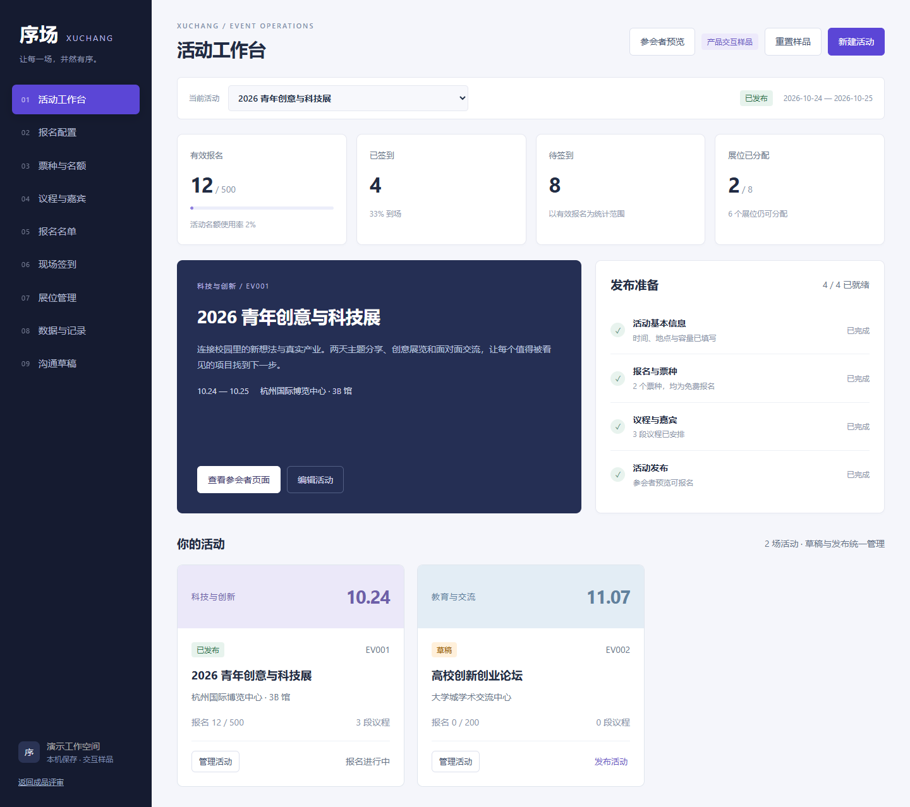

# 三套个人作品样品

门店经营分析、会展运营原型、珠宝独立站。通过 AI 协作完成的个人演示项目，用虚构数据和原创概念图展示产品思路与实现能力。

版本：V2，2026-10-02。所有项目均为自主制作的作品样品，不代表品牌委托、真实客户案例或生产系统上线。

| 作品 | 主要能力 | 交付 |
| --- | --- | --- |
| 澄色门店经营 | 经营分析、期间比较、异常到账核查与跟进 | 响应式看板、CSV 示例、公式 Excel |
| 序场会展 | 9 个运营模块，报名到签到的连续流程 | 交互原型、产品规格与验收 |
| MASON METAL 概念站 | 珠宝视觉、搜索收藏、商品对比与购物袋 | 响应式页面、Astra 子主题、Elementor 模板 |

## 如何体验

1. 点击 GitHub 的 **Code → Download ZIP**，解压。
2. 在浏览器打开 `docs/index.html`，即可离线体验全部网页，无需安装依赖。
3. 若使用本地 HTTP 预览，在仓库目录执行 `python -m http.server 8765 --directory docs`，访问 `http://127.0.0.1:8765/`。

GitHub 的源码页面不运行 HTML 交互；请下载后打开。项目数据保存在当前浏览器，样品按钮不会发送邮件、短信或创建真实订单。

## 澄色：门店经营看板


使用 150 笔虚构流水，按日期、门店和技师查看服务净额、订单均价、客户、期间复购、服务项目和支付渠道。新增等长上期比较、退款摘要和核查建议；缺少上期数据时明确标记。

到账核查支持待到账与金额差异、跟进人和备注、含备注的清单导出。备注不会更改财务金额。网页支持 CSV 导入导出，配套 Excel 使用可重算公式。

- [看板源码](docs/salon/)
- [公式 Excel](docs/downloads/门店经营模板.xlsx)
- [示例流水](docs/salon/示例流水.csv)
- [核查截图](screenshots/salon-reconciliation.png)

## 序场：会展运营交互原型



覆盖活动工作台、报名配置、票种名额、议程嘉宾、报名名单、现场签到、展位管理、数据记录和沟通草稿。包含主办方运营与参会者报名两个视角。

支持报名容量与重复手机号校验、同会场议程冲突检查、凭证下载、名单搜索筛选分页、批量签到、撤销原因、取消释放名额、展位释放、操作记录及导出。

- [原型源码](docs/expo/)
- [参会者页面截图](screenshots/expo-attendee-preview.png)
- [产品规格与验收 HTML](docs/downloads/会展产品规格与验收.html)

尚未接入后端、登录鉴权、公开报名链接、票务支付、扫码硬件或跨设备同步。沟通入口仅下载草稿。

## MASON METAL：珠宝站概念样品


原创 AI 银饰概念图与极简页面。支持系列筛选、关键词搜索、价格排序、收藏、最多三款商品比较、详情和尺码参考、购物袋增减与移除、赠礼备注和选择清单下载。

- [网站源码](docs/mason/)
- [商品对比截图](screenshots/mason-comparison.png)
- [Astra 子主题源码](wordpress/mason-metal-child/)
- [Astra 安装包](docs/downloads/mason-metal-child.zip)
- [Elementor 首页模板](wordpress/MASON-METAL-Elementor首页.json)
- [WordPress 安装说明 HTML](docs/downloads/WordPress安装说明.html)

这不是 MASON METAL 官方网站或已完成的品牌委托。商品、价格和图片为概念示例，尺码为通用参考；实际材料、库存、物流和售后需品牌确认。没有真实结账或支付，配套主题尚未在客户 WordPress 环境验收。

## 竞品依据与验证

依据 Eventbrite、Cvent、活动行、Fresha、Vagaro、Mejuri 和 Missoma 的官方公开功能资料改进信息组织与流程。[对比报告 HTML](docs/downloads/竞品对比与升级说明.html)逐项说明首版缺口、V2 改进和正式项目边界，内含官方来源链接。

[完整交付说明 HTML](docs/downloads/交付说明.html)与[验证记录](validation/)已纳入仓库。首版回归及 V2 检查覆盖关键表单、容量限制、议程冲突、撤销、收藏、对比、购物袋、离线打开及 390px 手机布局。测试无 JavaScript 运行错误。

## 文件结构

```text
docs/         可离线运行的三套网页、素材、文档和下载文件
wordpress/    Astra 子主题与 Elementor 模板
screenshots/  实际运行截图
validation/   已完成检查的记录
```

仓库不包含客户个人数据、账号会话、付费插件或商户密钥。完整交付包也在 `docs/downloads` 中。

## 复现浏览器检查

需要 Node.js、npm、Python 与已安装的 Google Chrome。先执行 `npm install`；另开终端运行 `python -m http.server 8765 --bind 127.0.0.1 --directory docs`，再执行 `npm test`。检查使用虚构数据并将截图写入被 Git 忽略的 `outputs/`。

WordPress 配套脚本只验证结构、静态资源与独立 JavaScript，不代表已通过真实 WordPress / PHP / Elementor 环境安装验收。
