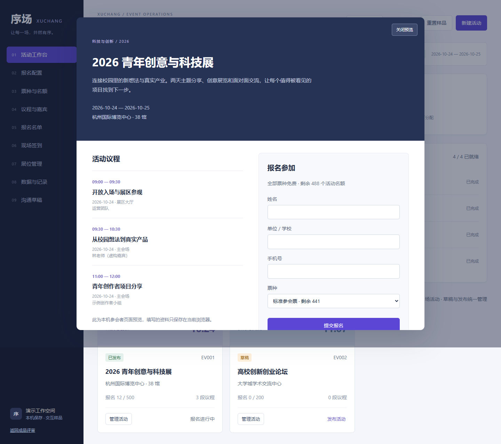

# 序场｜会展运营交互原型

个人产品原型，采用 AI 辅助开发，用虚构活动展示主办方与参会者两个视角。可提供原型演示、源码及研发说明。

- 9 个模块：活动、报名配置、票种名额、议程嘉宾、名单、签到、展位、数据记录、沟通草稿。
- 报名到凭证、名单与签到的连续流程；容量与重复手机号校验。
- 名单搜索、筛选、分页、批量签到；撤销需原因，取消释放名额。
- 同会场议程冲突检查、展位释放、操作记录与导出。

[产品规格与验收 HTML](../downloads/会展产品规格与验收.html) · [返回三套作品集](../../README.md)

下载仓库后，用浏览器打开本目录的 `index.html` 即可体验。数据仅保存在当前浏览器，没有生产后端、登录鉴权、公开报名链接、真实支付、扫码硬件或跨设备同步。沟通入口只下载草稿。
