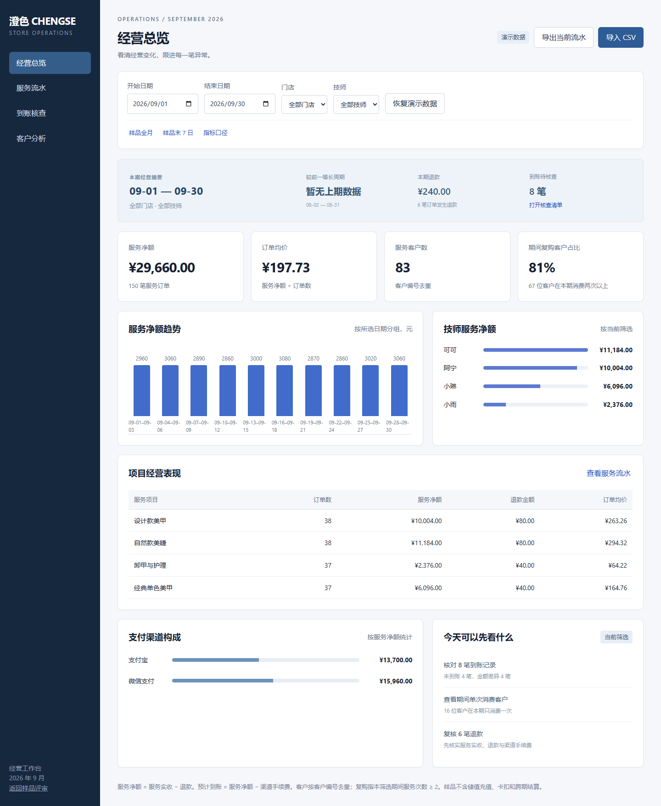

# 澄色｜门店经营看板与 Excel 模板

个人演示作品，采用 AI 辅助开发，使用虚构业务数据。展示门店经营分析、到账核查与异常跟进流程，可提供演示和源码。

- 日期、门店与技师筛选；净额、订单均价、客户复购、服务项目与支付渠道分析。
- 等长上期比较与退款摘要；没有上期数据时明确显示缺失。
- CSV 导入导出、未到账与金额差异核查、跟进人和备注、核查清单下载。
- 150 笔示例流水，配套可重算公式 Excel。

[下载 Excel 模板](../downloads/门店经营模板.xlsx) · [示例流水](示例流水.csv) · [返回三套作品集](../../README.md)

下载仓库后，用浏览器打开本目录的 `index.html` 即可体验。网页仅使用本机数据；未连接真实 POS、银行或支付系统。新增核查备注保存在浏览器，不自动写回 Excel。
